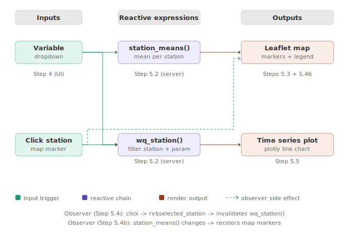
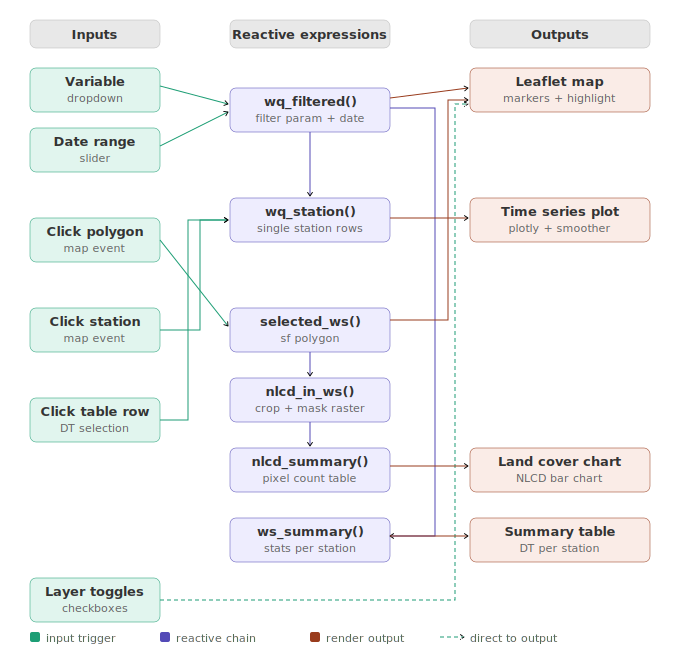

# Introduction to Data Dashboards Workshop

> A 3-hour hands-on workshop covering the fundamentals of interactive data dashboards, with a focus on R Shiny and environmental geospatial data. Developed by CGC-SCIPE research scientist Burch Fisher (`burch.fisher@umces.edu`) with the assistance of [Claude (claude.ai)](https://claude.ai).

---

## Table of Contents

- [Workshop Overview](#workshop-overview)
- [Schedule](#schedule)
- [Pre-Workshop Setup](#pre-workshop-setup)
- [Workshop Files](#workshop-files)
- [Part 1 — Presentation](#part-1--presentation)
- [Part 2 — Mini App Walkthrough](#part-2--mini-app-walkthrough)
- [Part 2b — Full App Walkthrough](#part-2b--full-app-walkthrough)
- [Part 3 — LLM Coding Session](#part-3--llm-coding-session)
- [Real Data Setup](#real-data-setup)
- [Sharing Your App](#sharing-your-app)
- [Resources](#resources)
- [Troubleshooting](#troubleshooting)

---

## Workshop Overview

This workshop introduces participants to the world of interactive data dashboards. By the end, you will be able to:

- Understand the landscape of dashboard tools and the tradeoffs between them
- Read and navigate R Shiny code — UI, server, inputs, outputs, and reactive linkages
- Run and interact with a fully working geospatial dashboard using real Chesapeake Bay data
- Use an LLM coding assistant to extend an existing app or build a new one from your own data

No prior R Shiny experience is required. Basic familiarity with R is helpful but not essential.

---

## Schedule

| Time | Segment | Description |
|------|---------|-------------|
| 0:00 – 0:35 | **Part 1 — Presentation** | What are data dashboards, why build them, landscape of tools, sharing paradigms (local → cloud), intro to tile servers and large data considerations |
| 0:35 – 1:50 | **Part 2 — Code Walkthrough** | `mini_app.R` first (6 steps, ~25 min), then `app.R` (reactive linkages and live demo, ~50 min) |
| 1:50 – 2:00 | *Break* | |
| 2:00 – 3:00 | **Part 3 — LLM Coding Session** | Extend `mini_app.R` using an LLM assistant, or build a dashboard from your own dataset |

---

## Pre-Workshop Setup

**Please complete all setup steps before arriving.** There will not be time to troubleshoot installations during the session.

---

### 1. Install R and RStudio

- Download and install **R** (version >= 4.2): https://cran.r-project.org/
- Download and install **RStudio Desktop** (free): https://posit.co/download/rstudio-desktop/

Check your R version by running `R.version$version.string` in the RStudio console. Update if below 4.2.

---

### 2. Install Required R Packages

Open RStudio and run the following in the **Console**:

```r
install.packages(c(
  "shiny",
  "shinydashboard",
  "leaflet",
  "raster",
  "sf",
  "terra",
  "dplyr",
  "tidyr",
  "readr",
  "plotly",
  "DT",
  "zoo"
))
```

To verify everything installed correctly:

```r
library(shiny)
library(leaflet)
library(sf)
library(terra)
cat("All packages loaded successfully!\n")
```

**Note on leaflet.extras:** This package is not currently available on CRAN for R 4.x and has been removed from the demo app. See Step 1 of `app.R` for re-enable instructions if it becomes available.

---

### 3. Download the Workshop Files

1. Go to the workshop GitHub repository: [https://github.com/CGC-UMCES/WORKSHOP-interactive-shiny-dashboards/tree/main](https://github.com/CGC-UMCES/WORKSHOP-interactive-shiny-dashboards/tree/main)
2. Click the green **Code** button near the top right
3. Select **Download ZIP**
4. Once downloaded, unzip the file and move the resulting folder somewhere easy to find — your Desktop is a good choice
5. In RStudio, set your working directory to that folder: **Session → Set Working Directory → Choose Directory**
6. You should see `mini_app.R`, `app.R`, `data_prep.R`, and this README in the folder

The folder can be named anything. The apps just need the `data/` subfolder to be in the same directory as the `.R` files.

---

### 4. Bring Your Own Dataset (optional but encouraged)

During Part 3 you will have the option to build a dashboard from your own data. Please bring:

- A dataset in CSV, Excel, or shapefile format
- Ideally something with a geographic component (lat/lon columns, state/country names, or a shapefile), but any tabular data works
- A CSV with at least one numeric column and one categorical or location column is perfect

Don't stress about having a perfect dataset — the goal is to practice the workflow.

---

## Workshop Files

```
workshop_files/
├── presentation.pdf                  # Part 1 slides
├── mini_app.R                        # Simple 6-step intro app (start here in Part 2)
├── mini_app_reactive_linkages.svg    # Reactive diagram for mini_app.R
├── app.R                             # Full annotated 17-step demo app
├── app_reactive_linkages.svg             # Reactive diagram for app.R
├── data_prep.R                       # Downloads real data (run once, optional)
├── data/                             # Real data files (created by data_prep.R)
│   ├── wq_baltimore.csv
│   ├── watersheds_baltimore.gpkg
│   └── nlcd_baltimore.tif
└── README.md                         # This file
```

Both apps load data from the `data/` folder included in this repository — no download step needed. `app.R` also includes a simulated data fallback if the data folder is missing. If you are curious how the real data was downloaded and prepared, see `data_prep.R`.

---

## Part 1 — Presentation

Covered live during the workshop. Topics include:

- What are data dashboards and when should you build one
- Landscape of tools: R Shiny, Plotly, Google Earth Engine Apps, Observable, and others
- Sharing paradigms: local → tunneled → cloud hosted → serverless (see [Sharing Your App](#sharing-your-app))
- Large data considerations: tile servers, raster resolution tradeoffs, browser rendering limits
- Introduction to R Shiny concepts: UI, server, inputs, outputs, reactivity

---

## Part 2 — Mini App Walkthrough

`mini_app.R` is a stripped-down Shiny app designed to introduce the three core Shiny concepts before tackling the full dashboard:

- **One input** — a parameter dropdown in the sidebar
- **One event** — clicking a station marker on the map
- **Two outputs** — the map (markers colored by mean value) and a time series plot

The code is divided into 6 steps. Steps 1–3 can be run interactively in the console to explore the data. Steps 4–6 must be sourced together to launch the app.

**Suggested walkthrough order:**

1. Run Steps 1–3 in the console — inspect `wq` and `stations`, understand the data structure
2. Read Steps 4–5 as a group — identify `inputId`, `outputId`, `reactive()`, and `observeEvent()`
3. Source the whole file — click **Source** in RStudio or Ctrl+Shift+Enter
4. Interact with the app — change the dropdown, click a marker, observe what updates
5. Look at the reactive diagram below — trace every arrow back to the code



**Key concept:** the dropdown and the map click are two completely different kinds of inputs, but they both feed into the same reactive expression (`wq_station()`), which automatically propagates to the time series plot. No manual refresh logic anywhere.

---

## Part 2b — Full App Walkthrough

`app.R` is a fully annotated 17-step dashboard for the Baltimore Harbor / Chesapeake Bay region. Rather than walking every step line by line, focus the group walkthrough on:

- **Step 3** — simulated data as a way to build an app in preparation for real world data
- **Step 4** — lookup tables and the named vector pattern (`"Label" = "value"`)
- **Step 5** — UI structure: identifying every `inputId` and `outputId`
- **Steps 7–8** — reactive expressions: how `wq_filtered()` serves as a shared data hub for multiple outputs
- **Step 9** — `renderLeaflet` vs `leafletProxy` — why the map doesn't redraw on every click
- **Steps 10–11** — observers and event handlers: map clicks writing to `reactiveValues`
- **Steps 12–14** — render functions: how three outputs share one reactive expression

The annotated steps are there as reference — students can read them at their own pace. Use the reactive diagram as a navigation aid during the walkthrough.



**`app.R` runs with either simulated data or the real data files** — real world data is active by default. To swap in simulated Chesapeake Bay data, change the first line of Step 3 to `True` in app.R (see [Real Data Setup](#real-data-setup)). `mini_app.R` requires the real data files and will not run without them.

**Features to demonstrate live:**
- Toggle NLCD land cover on and off, switch basemaps — observe z-ordering keeps the raster visible
- Click a watershed polygon — land cover chart updates to show that watershed's composition
- Click a station marker — time series appears, corresponding table row highlights
- Click a table row — yellow ring appears on the map marker
- Change the parameter dropdown — all four panels update simultaneously
- Move the date range slider — summary statistics recalculate across all stations

---

## Part 3 — LLM Coding Session

The last hour is for hands-on coding with an LLM assistant (Gemini or other of your choice). Choose the track that fits your goals.

**A key tip before you start:** you do not need real data to build a working app. You can ask the LLM to generate simulated data that matches whatever structure you want — a time series, a set of spatial points, a categorical dataset — and build the full app around it first. Once the app is working, swapping in real data is usually just changing the data loading step. This is the same approach used in `app.R`, which has a full simulated data fallback built in. A good prompt to get started:

*"Build a simple Shiny app with a map and a time series plot. Use simulated data — generate 10 monitoring stations with random lat/lon coordinates around [your region], and simulate monthly measurements of [your variable] from 2020 to 2024."*

---

### Track A — Extend mini_app.R (no data needed)

Start from `mini_app.R` and progressively add features. Suggested prompts:

**Level 1 — Small modifications:**
- *"Modify mini_app.R so users can select multiple stations by clicking. Clicking a selected station should deselect it. Show all selected stations as separate colored lines on the time series."*
- *"Add a date range slider to mini_app.R that filters the time series to the selected date window."*
- *"Add a smoothing window dropdown (3, 6, or 12 months) that controls a rolling average line on the time series."*

**Level 2 — Add a new panel:**
- *"Add a summary statistics table below the time series in mini_app.R showing mean, min, max, and N for the selected station and parameter."*
- *"Add a bar chart showing the distribution of monthly values for the selected station."*

**Level 3 — Move toward app.R:**
- *"Add watershed polygon layers to mini_app.R using watersheds_baltimore.gpkg. Clicking a watershed should highlight it and filter station markers to only show stations within that watershed."*
- *"Convert mini_app.R from fluidPage to a shinydashboard layout with a sidebar and a 2x2 panel grid like app.R."*

---

### Track B — Bring your own data

Use `mini_app.R` as a template to visualize your own dataset or create your own from scratch. Suggested starting prompt:

*"I have a CSV file called [filename] with columns [list your columns]. I want to build a Shiny app similar to mini_app.R that shows [describe what you want]. The app should have a map showing [geographic component] and a [time series / bar chart / scatter plot] of [data component]. Here is the mini_app.R code as a starting point: [paste the full code]."*

Tips for a productive LLM session:
- Paste the full `mini_app.R` code into your first message so the LLM has context
- Describe your data structure explicitly — column names, data types, and geographic format
- Ask for one change at a time rather than everything at once
- If something breaks, paste the exact error message and ask for a fix
- Ask the LLM to explain what it changed and why — you will learn faster

---

### Track C — Replicate an app.R feature

Pick one feature from `app.R` and ask the LLM to help you add it to `mini_app.R`:

- *"app.R uses a raster-vector query to show NLCD land cover composition inside a clicked watershed polygon. Help me add this to mini_app.R."*
- *"app.R pre-renders the NLCD raster into a custom Leaflet pane so it persists when the basemap switches. Help me add NLCD support to mini_app.R."*
- *"app.R shows a 6-month rolling average smoother on the time series. Help me add this to mini_app.R and wire it to a slider that controls the window size."*

---

## Real Data Setup

The real data files are included in the repository `data/` folder — no download step is needed to run the apps. `data_prep.R` is provided for transparency and reproducibility, showing exactly how the data was downloaded and processed from public sources. If you want to refresh the data or adapt the workflow for a different region, run `data_prep.R` after installing the additional packages below.

Additional packages needed:

```r
install.packages(c("dataRetrieval", "nhdplusTools", "FedData", "lubridate", "purrr"))
```

Expected run time: 1–5 minutes depending on connection speed.

| Layer | Dataset | Source | Size |
|-------|---------|--------|------|
| Water quality | CBP monitoring network, 8 stations, 2015–2023 | EPA Water Quality Portal via `dataRetrieval` | ~213 KB |
| Watershed polygons | USGS NHD HUC8 boundaries, 4 units | USGS NHD via `nhdplusTools` | ~584 KB |
| NLCD raster | NLCD 2021, ~150m resolution, clipped to region | MRLC via `FedData` | ~160 KB |

---

## Sharing Your App

There is a spectrum of ways to share a Shiny app, each with different tradeoffs in cost, complexity, and performance. This spectrum is covered in Part 1 of the presentation.

---

### 1. Local only (localhost)

The default when you click Run App in RStudio. Only accessible on your own machine. Good for development and testing. No setup required.

---

### 2. Tunneled (ngrok)

Creates a secure public URL pointing to your locally running app. Framework agnostic — works identically for Shiny, Streamlit, Flask, FastAPI, Dash, or any local web server.

**One-time setup:**

```bash
# Mac
brew install ngrok/ngrok/ngrok

# Windows: download from https://ngrok.com/download

# Register your free auth token (from https://dashboard.ngrok.com)
ngrok config add-authtoken YOUR_TOKEN_HERE
```

**Each session:**

1. Run App in RStudio — note the port number in the browser URL (e.g. `4533`)
2. Open a new terminal and run: `ngrok http 4533`
3. Share the forwarding URL: `https://abc123.ngrok-free.app`

Free tier: URL changes every session, ~2 hour timeout, both the app and terminal must stay open.

---

### 3. Cloud hosted (shinyapps.io)

Permanent public URL, runs independently of your laptop. Free tier: 5 apps, 25 active hours per month.

```r
install.packages("rsconnect")
library(rsconnect)
rsconnect::setAccountInfo(name = "YOUR_NAME", token = "YOUR_TOKEN", secret = "YOUR_SECRET")
rsconnect::deployApp()
```

Other options: Posit Connect (institutional), AWS, Google Cloud, DigitalOcean.

---

### 4. Institutional server

Many universities and research agencies run Shiny Server or Posit Connect behind a firewall. Common when data cannot leave the institution. Contact your IT or research computing group.

---

### 5. Containerized (Docker)

Packages the app and its entire R environment into a container that runs identically anywhere. Solves the "works on my laptop" problem. Not a hosting solution itself but makes cloud deployment straightforward.

---

### 6. Client-side / serverless (Shinylive)

Compiles R to WebAssembly so the app runs entirely in the browser — no server required. Can be hosted on GitHub Pages for free. Tradeoffs: slow initial load (~50MB+), limited package support (`sf` and `terra` may not work), all data must be bundled with the app.

More info: https://shiny.posit.co/py/docs/shinylive.html

---

### 7. Embedded in a website (iframe)

Any hosted Shiny app can be embedded in a webpage. Requires the app to already be hosted via one of the options above.

```html
<iframe src="https://YOUR_NAME.shinyapps.io/YOUR_APP" width="100%" height="600px"></iframe>
```

---

### 8. API only (Plumber / FastAPI)

Expose data processing as a REST API rather than a full dashboard. Other tools or front-ends query the API and build their own interface. In R use the `plumber` package; in Python use FastAPI or Flask.

---

### 9. Scheduled / static export (Quarto, Observable)

Quarto and R Markdown can render interactive-looking HTML outputs with Plotly charts and DT tables as fully static files. Observable notebooks add JavaScript-based reactivity. A useful middle ground between a static report and a full Shiny app.

---

## Resources

### R Shiny
- [Shiny Official Docs](https://shiny.posit.co/r/getstarted/)
- [Mastering Shiny (free book)](https://mastering-shiny.org/)
- [Shiny Cheatsheet (PDF)](https://posit.co/wp-content/uploads/2022/10/shiny-1.pdf)

### Geospatial in R
- [sf package documentation](https://r-spatial.github.io/sf/)
- [terra package documentation](https://rspatial.org/terra/)
- [Leaflet for R](https://rstudio.github.io/leaflet/)

### Dashboard Tools
- [Plotly for R](https://plotly.com/r/)
- [Google Earth Engine Apps](https://developers.google.com/earth-engine/guides/apps)
- [ngrok](https://ngrok.com/docs)
- [shinyapps.io](https://www.shinyapps.io)

### LLM Coding Assistants
- [Google Gemini](https://gemini.google.com/app) - Available through UMCES accounts
- [Claude (claude.ai)](https://claude.ai)
- [ChatGPT](https://chatgpt.com)

---

## Troubleshooting

**Package installation fails:**
```r
update.packages(ask = FALSE)
install.packages("package_name")
```

**`leaflet.extras` not available:** Not on CRAN for R 4.x. Removed from the demo app. See Step 1 of `app.R`.

**Special characters show as ? in RStudio viewer:** Font rendering issue in the viewer pane only. Click **Open in Browser** — the browser renders everything correctly and gives more screen space.

**RStudio does not recognize R:** Go to Tools → Global Options → R General and point RStudio to your R installation.

**App won't run:** Make sure your working directory is set to the folder containing `app.R` and the `data/` subfolder. In RStudio: Session → Set Working Directory → To Source File Location.

**data_prep.R times out on the water quality download:** The script downloads one station at a time to avoid WQP server timeouts. If it still fails, wait a few minutes and re-run — the WQP server can be temporarily overloaded.

**NLCD layer shows gray screen in the app:** The raster file may be too large for `addRasterImage`. Re-run Part 3 of `data_prep.R` to regenerate it at ~150m resolution.

**ngrok shows ERR_NGROK_3200:** The tunnel has dropped. Check that both the Shiny app and the ngrok terminal are still running. Re-run `ngrok http PORT` to get a new URL.

**Still stuck?** Open an issue in this repository or email `burch.fisher@umces.edu` before the workshop date.

---

*Workshop materials developed for a mixed audience of faculty, researchers, and students. Please open an issue or pull request if you find errors or have suggestions.*
